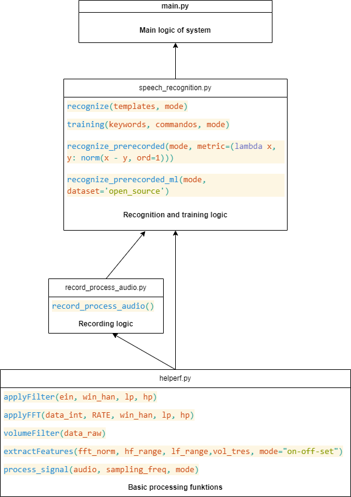

# **Programmdesign**

## **Lernphase**
1. Nutzer ließt vorgefertigten Text. 
2. Spezielle Schlüsselwörter, wie "Exo", "Ok" und "Nein" werden mehmals vorgelesen (da sie von besonderer Bedeutung sind und wir wollen, dass sie mit höchstmöglicher Wahrscheinlichkeit erkannt werden)
2. Aufezeichntes Audiosignal wird mit On/Off-Sets markiert
3. Die Abschnitte zwische On/Off-Sets werden:\
    a. filtriert\
    b. windowed\
    c. Features der Wahl werden extrahiert und abgespeichert im Dictionary mit entsprechender Bezeichnunng

## **Erkennungsphase**
1. Programm nimmt das Signal zwischen On/Off-Sets und verarbeitet es, wie in der Lernphase
2. Das verarbeitete Signal wird mit dem kleineren Satz von Templates für das Schlüsselwort "Exo" verglichen.
3. Falls Schlüsselwort erkannt - gehe zum nächsten Schritt, falls nicht - gehe zurück zu 1
4. Signal zwischen nächster Parr von On/Off-Set soll ein Kommando sein. Das Stück wird genau wie vorher verarbeitet.
5. Das verarbeitete Stück wird mit dem Satz von Templates für Kommandos verglichen. Hier Einsatz von Fast-KNN möglich, um das Prozess bei großem Satz zu beschleunigen.
6. Falls GUI verfügbar - Kommando wird erst da ausgegeben. Bis dann wird nach Kommandos im Signal nicht gesucht.
7. Falls kein Kommando erkannt wurde, und GUI vorhanden - gebe so was wie "Exo wurde erkannt, aber kein Kommando danach. Wollen Sie noch mal versuchen?" und gehe zu Feedbackphase Schritt 4
8. Kein GUI vorhanden - gehe zu Schritt 1 von Erkennungsphase

## **Feedbackphase**
1. Sobald das Kommandoname auf dem Bildschirm angezeigt wird - suche nach Feedbackschlüsselwörter im Audiosignal, nach dem Verfahren, wie oben
2. Falls "Ok" erkannt wird - leite die Info weiter zur Ausführung
3. Falls "Nein" erkannt wird - kehre zum Schritt 1 von Erkennungsphase
4. Falls Schritt 7 der Erkennungsphase statt fand: "Ok" wird erkannt - gehe zur Erkennungsphase Schritt 4, "Nein" wird erkannt - gehe zur Erkennungsphase Schritt 1

## **TODO**
Ordentliche Dokkumentation (mit allen Charts und Funktionbeschreibungen)